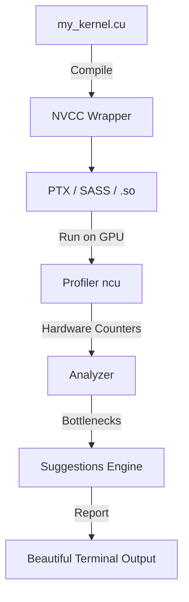

# 🚀 cuda-insight

[](https://badge.fury.io/py/cuda-insight)
[](https://opensource.org/licenses/Apache-2.0)
[](https://www.python.org/downloads/)
[](https://github.com/Paramveersingh-S/cuda-insight/actions)

> **"Write CUDA. Understand it. Fix it. Ship faster."**

`cuda-insight` is a comprehensive CLI and Python library that takes a CUDA `.cu` file (or a PyTorch custom op), compiles it, runs it on the GPU, profiles it using NVIDIA's profiling APIs, and returns a structured, human-readable report with actionable fix suggestions.

## ✨ Features (Coming Soon)
- Achieved vs theoretical occupancy
- Memory bandwidth utilization
- Warp divergence hotspots
- Bank conflict detection
- Register pressure analysis
- Side-by-side PTX annotation
- Actionable fix suggestions

## 📦 Installation

```bash
pip install cuda-insight
```

## 🚀 Quick Start (Coming Soon)

```bash
cuda-insight profile mykernel.cu --kernel my_kernel --block 256 --grid 1024
```

## 🏗️ Architecture Flow



## 🤝 Contributing
See `CONTRIBUTING.md` for details on how to set up the dev environment and run tests.

## 📄 License
Apache 2.0
