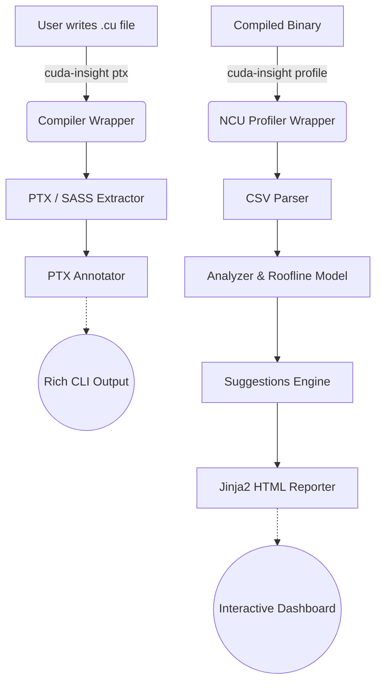

# 🚀 CUDA Insight: Profile, Analyze, Optimize


> **Write CUDA. Understand it. Fix it. Ship faster.**

CUDA Insight is an all-in-one educational toolkit and profiler designed to demystify GPU performance. Whether you're learning CUDA or optimizing a production kernel, CUDA Insight wraps NVIDIA's powerful toolchain into a simple, actionable workflow.

---

## ✨ Features

- **📊 Hardware Discovery (`gpu-info`)**: Instantly retrieve specs like theoretical TFLOPS, memory bandwidth, and compute capability.
- **🔍 PTX Annotation (`ptx`)**: Automatically map generated PTX assembly instructions directly to your original C++ source lines.
- **⚡ One-Click Profiling (`profile`)**: Automatically runs `ncu` (Nsight Compute), captures metrics, and generates a structured analysis report.
- **🧠 Expert Suggestions Engine**: Identifies bottlenecks (e.g., Bank Conflicts, Register Pressure) and provides actionable code snippets to fix them.
- **📈 Roofline Modeling**: Automatically generates visual Roofline charts (`roofline.png`) to show how close your kernel is to the theoretical hardware limit.
- **🔥 PyTorch Integration**: Easily profile your custom PyTorch C++ extensions via our `torch_ext` API.

---

## 🛠️ Installation

```bash
pip install -e ".[dev]"
```

*Requirements: NVIDIA GPU, `nvcc`, and `ncu` (Nsight Compute) must be in your `PATH`.*

---

## 🚀 Quick Start

### 1. View GPU Specs
```bash
cuda-insight gpu-info
```

### 2. Inspect Assembly (PTX/SASS)
```bash
# See how your CUDA maps to PTX
cuda-insight ptx kernels/matmul/naive.cu --annotate
```

### 3. Profile & Analyze a Kernel
```bash
# Compile and profile a binary. Generates HTML report and Roofline chart.
nvcc kernels/matmul/naive.cu -o naive_matmul
cuda-insight profile naive_matmul --html --roofline
```

---

## 📚 Reference Kernels Library

Inside the `kernels/` directory, you'll find a progressive library of algorithms showing the evolution from *naive* to *state-of-the-art*:

- **Matrix Multiplication (`matmul/`)**: Naive $\rightarrow$ Shared Memory Tiling $\rightarrow$ cuBLAS Reference
- **Parallel Reduction (`reduction/`)**: Atomic $\rightarrow$ Block Shared Mem $\rightarrow$ Warp Primitives
- **Softmax (`softmax/`)**: Two-Pass $\rightarrow$ Online Normalizer (FlashAttention style)
- **Attention (`flash_attention_minimal/`)**: Block-Sparse Fused Attention
- **Quantization (`quantization/`)**: INT8 `dp4a` Gemm

Each kernel includes an educational header block explaining the optimization, expected speedup, and further reading links!

---

## 🏗️ Architecture & Workflow



---

## 🧠 Example Output

### Bottleneck Detection
If you run the naive matmul, CUDA Insight will tell you:
> **Bottleneck: Memory Bandwidth Bound**  
> *Kernel is bottlenecked by global memory bandwidth. Utilizing 98% of peak.*  
> **Fix:** Use shared memory tiling to reduce global memory reads.

---

## 🤝 Contributing

Contributions are welcome! If you want to add a new reference kernel (e.g., Prefix Scan, GEMV, Convolution), feel free to open a PR.

## 📝 License
MIT License.
